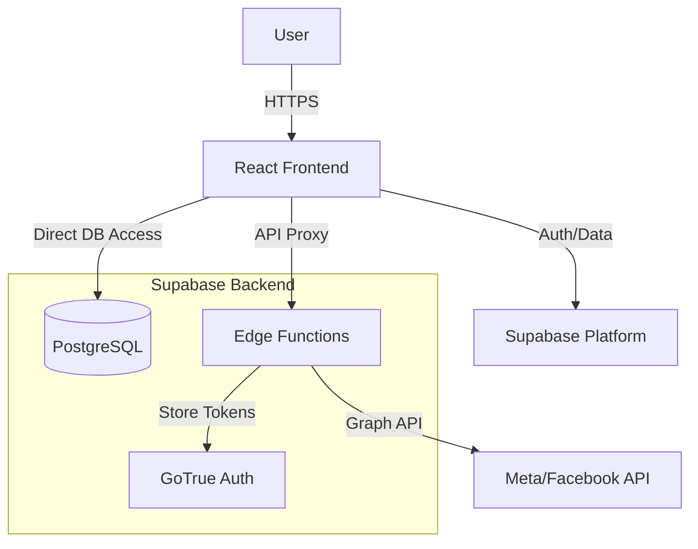

# SPEC.md - Meta Ads Manager Pro

## 1. System Architecture

The application follows a modern Serverless architecture, leveraging Supabase for backend services and React for the frontend.



---

## 2. Database Design

### 2.1 Core Tables

#### `public.user_profiles`
Stores user onboarding and profile data. Linked 1:1 with `auth.users`.

| Column | Type | Description |
|--------|------|-------------|
| `id` | uuid | Primary Key, FK to `auth.users.id` |
| `full_name` | text | User's full name |
| `company_name` | text | Company/Organization name |
| `role` | text | User's role (e.g., Media Buyer) |
| `business_type` | text | Type of business (e.g., E-commerce) |
| `goals` | text[] | Array of user goals |
| `created_at` | timestamp | Creation timestamp |
| `updated_at` | timestamp | Last update timestamp |

### 2.2 Auth Integration
- **Supabase Auth**: Manages users and sessions.
- **User Metadata**: Stores sensitive third-party tokens (Facebook Access Token).
  - `facebook_access_token`: Encrypted in Supabase Auth user metadata.
  - `token_expires_at`: Expiration timestamp for the token.

---

## 3. API Specifications (Edge Functions)

### 3.1 `meta-auth`
Handles the OAuth flow and token exchange with Facebook.

- **Endpoint**: `/functions/v1/meta-auth`
- **Method**: `POST`
- **Purpose**: Exchange short-lived token for long-lived token.
- **Payload**: `{ access_token: string }`
- **Process**:
  1. Verifies the received user access token with Facebook.
  2. Requests a long-lived token (60 days validity).
  3. Updates the Supabase User Metadata with the new token.

### 3.2 `meta-api`
Acts as a secure proxy to the Meta Graph API.

- **Endpoint**: `/functions/v1/meta-api`
- **Method**: `POST`
- **Security**: Custom JWT verification (Auto-verify disabled to prevent 401 issues, manual logic implemented).
- **Supported Actions**:
  - `businesses`: Fetch user's Business Managers.
  - `adaccounts`: Fetch Ad Accounts for a BM (owned + client).
  - `campaigns`: List campaigns for an Ad Account.
  - `campaigns_with_insights`: List campaigns enriched with insights (impressions, spend, etc.).
  - `insights`: Fetch aggregated account performance.
  - `insights_timeseries`: Fetch daily/weekly performance data.

---

## 4. Frontend Architecture

### 4.1 Technology Stack
- **Framework**: React 19 + Vite
- **Language**: TypeScript
- **Styling**: Tailwind CSS v4 + Lucide React Icons
- **State/Data**: React Context (Auth), Local State
- **Charting**: Recharts

### 4.2 Key Services
- **`metaService.ts`**: Central service for Meta API interactions.
  - Handles Supabase session refreshing.
  - Manages error handling (401 invalid JWT, Permission errors).
  - Caches selected Business Manager/Ad Account IDs in `localStorage`.
  
- **`supabaseClient.ts`**: Configured Supabase client instance.

### 4.3 Directory Structure
```
src/
├── components/       # Reusable UI components
│   ├── overview/     # Dashboard specific widgets (KPIs, Charts)
│   └── ui/           # Generic UI elements (Buttons, Inputs)
├── context/          # Global state (AuthContext)
├── hooks/            # Custom hooks (data fetching helpers)
├── layouts/          # Page layouts (DashboardLayout)
├── pages/            # View components (Campaigns, Settings)
└── services/         # API integration logic
```

---

## 5. Security Model

### 5.1 Authentication
- Uses **Supabase Auth** with email/password and social login capabilities.
- Sessions are persisted in browser storage.
- **Critical Fix**: Frontend explicitly checks and refreshes sessions before API calls to prevent premature expiration.

### 5.2 Authorization (RLS)
- Row Level Security (RLS) is enabled on `public.user_profiles`.
- **Policy**: `Users can select/insert/update own profile using (auth.uid() = id)`.

### 5.3 API Security
- **Edge Functions**:
  - Do not expose Facebook Access Tokens to the client-side logic where possible (although currently stored in metadata for ease of access).
  - Validate the `Authorization` header (Supabase JWT) to ensure the caller is an authenticated user.
  - **Rate Limiting**: Implemented in `meta-api` (e.g., 60 requests/min per user).

---

## 6. Implementation Plan - Next Steps

### Phase 2: Enhanced Campaign Management
1. **Details View**: Create route `/campaigns/:id` to show ad sets and ads.
2. **Write Operations**: Implement `pause`/`activate` buttons using `meta-api`.
3. **Creation Flow**: Multi-step wizard for creating new campaigns.

### Phase 3: Advanced Intelligence
1. **AI Analysis**: Integrate Gemini API (via Edge Function) to analyze campaign performance.
2. **Smart Alerts**: Backend job to check daily performance and create notifications.
